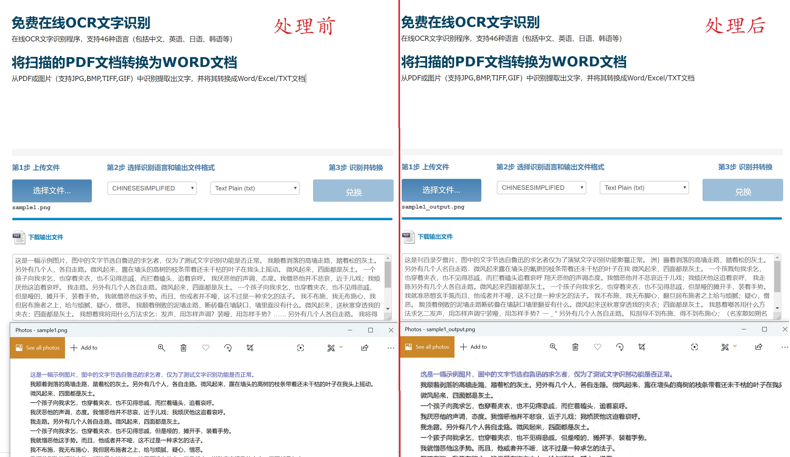

# Momus
### Momus is a cross-platform image processing tool that designed to counter AI censorship on social media.
### Momus是一款用来绕过社交平台AI图片审查的跨平台工具

#### Monus uses SIFT（Scale Invariant Feature Transform） from opencv to detect all keypoint on img then add noise to avoid auto-detection.
#### Monus使用opencv库中的SIFT（Scale Invariant Feature Transform）算法来标记所有的关键点，然后添加噪音来避免社交平台的自动审查

Libraries:
```
PySimpleGUI
numpy
cv2
matplotlib
pillow
```

Install:
```bash
pip3 install -r requirements.txt
```
run:
```bash
python3 Momus.py
```
Pack to exe:
```
pyinstaller -F -i logo.ico -w Momus.py -p image_processing.py
```
Download Release:
[Github](https://github.com/LevyHsu/Momus/releases)
[levyhsu.com](https://levyhsu.com/uploads/Momus.exe)

output file(Under same dir):
```
output.png
```

### Demo:




